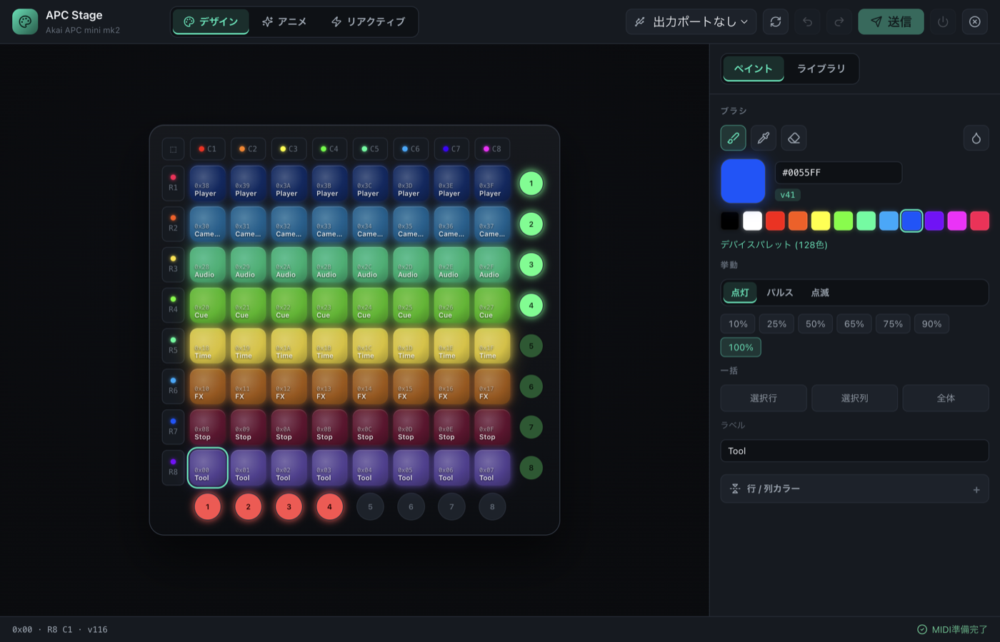
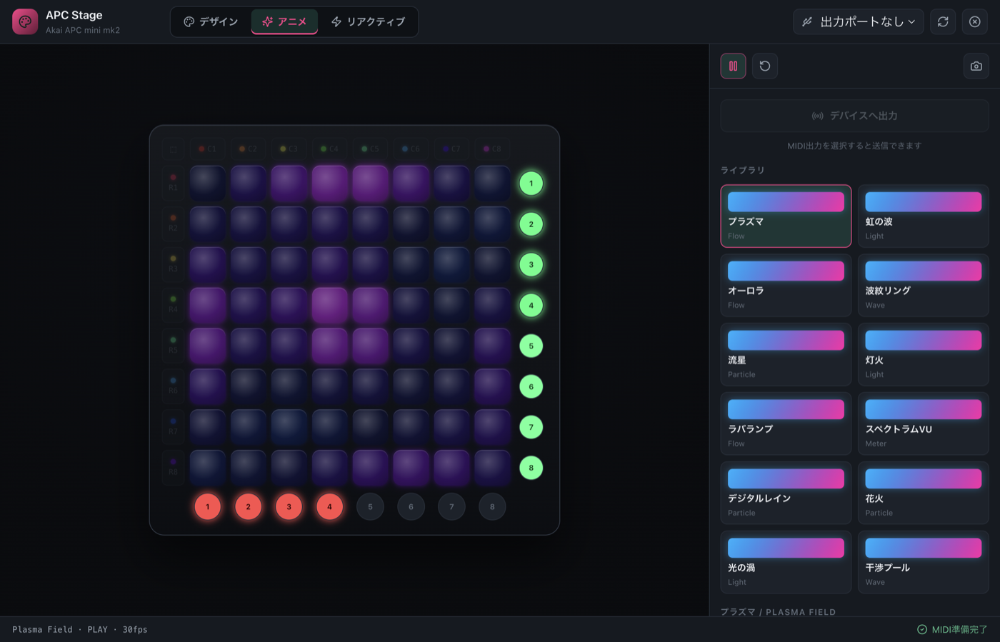
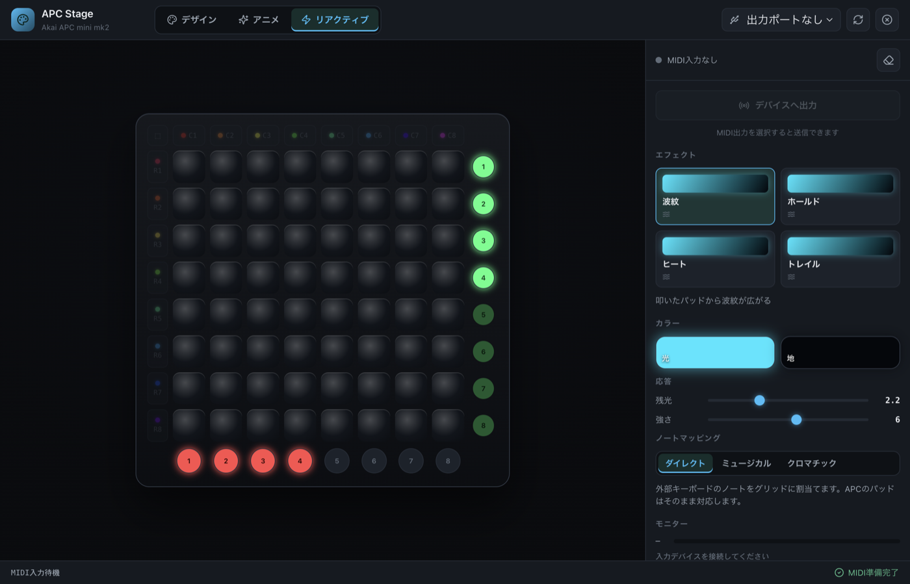

# APC Stage

Akai Professional **APC mini mk2** の 8×8 RGB パッドと周辺の単色LEDを、Ableton なしで自由に光らせるデスクトップアプリです。Electron + Web MIDI 製で macOS / Windows を想定しています。

色をデザインする **デザイン**、滑らかに光らせる **アニメーション**、MIDI入力に反応する **リアクティブ** の3モードを、相互排他で切り替えて使います。

> このリポジトリの旧「APC Color Controller」を全面的に作り直したものです（UI名は **APC Stage**、配布アプリ名は引き続き `APC Color Controller.app`）。



## 3つのモード

### 🎨 デザイン — 色を塗る

- **ブラシ / スポイト / 消しゴム** でパッドを直接ペイント（ドラッグ塗り対応、ショートカット <kbd>B</kbd> / <kbd>I</kbd> / <kbd>E</kbd>）
- グリッド外周の**ハンドルで 行・列・全体を一括塗り**（Shift で消去）
- **行 / 列カラー**（各8本）と 虹・暖・寒・単 のジェネレーター
- 公式128色の**デバイスパレット**、クイック / 最近使った色、明るさ・パルス・点滅の挙動
- **名前付きプリセットの保存・読み込み**（発光サムネイル付き）、JSON 書き出し / 読み込み
- **Undo / Redo**（<kbd>⌘Z</kbd> / <kbd>⌘⇧Z</kbd>）
- MIDI出力を選ぶと、**編集が実機へリアルタイム反映**されます（送信ボタンを待ちません）

### ✨ アニメーション — 滑らかに光らせる



- **12種の時間ベースアニメーション**：プラズマ / 虹の波 / オーロラ / 波紋リング / 流星 / 灯火 / ラバランプ / スペクトラムVU / デジタルレイン / 花火 / 光の渦 / 干渉プール
- 2色（A / B）・速度・強さ ＋ 種類ごとの追加パラメータ
- 画面プレビューは 60fps、**デバイス出力は 30fps に最適化**（前フレームから変化したパッドだけを SysEx 送信）
- **「デバイスへ出力」** を ON にすると実機で再生。現在のフレームをデザインとして保存することもできます

### ⚡ リアクティブ — Note に反応する



- APC本体のパッドや**外部MIDIキーボード**の入力に反応して光ります
- エフェクト：**波紋 / ホールド / ヒート / トレイル**
- ノートマッピング：**ダイレクト / ミュージカル / クロマチック**（鍵盤のノートをグリッドへ割当て）
- 残光・拡散・強さ・カラーを調整、入力モニター付き

## ダウンロード

配布版は [GitHub Releases](https://github.com/llcheesell/apc-mini-mk2-color-controller/releases) から。

- macOS Apple Silicon: `.dmg` または `.zip`
- Windows: Windows 環境でビルドした `.exe` インストーラー

macOSビルドはローカル配布向けの**未公証アプリ**です。初回起動時に Gatekeeper の確認が出る場合は、Finder で右クリック →「開く」で起動してください。

## 開発 / ビルド

```bash
npm install
npm run dev      # Vite + Electron をホットリロードで起動
npm start        # ビルド済み画面で起動
npm run dist     # 配布パッケージ（macOS: .app / .dmg / .zip）を作成
npm run shot     # docs/screenshots/ のスクリーンショットを再生成
```

macOS では `release/mac-arm64/APC Color Controller.app`、DMG、ZIP が生成されます。Windows 版は Windows 環境で `npm run dist` を実行すると NSIS インストーラーを作成します。

## 使い方のヒント

- **APC mini mk2 は同時に1つのMIDI接続のみ** 受け付けます。他のアプリ（DAW や別インスタンス）がポートを掴んでいると接続できません。テスト前に他を終了してください。
- アニメ / リアクティブは既定で**プレビューのみ**です。実機を光らせるには各モードの **「デバイスへ出力」** を ON にしてください。
- 緊急停止：右上の **PANIC（✕）** で全パッド・全単色LEDを消灯します。

## MIDI仕様メモ

参照仕様: [APC mini mk2 Communications Protocol v1.0](https://cdn.inmusicbrands.com/akai/attachments/APC%20mini%20mk2%20-%20Communication%20Protocol%20-%20v1.0.pdf)

- パッド番号は `0x00`〜`0x3F`。実機の下段左が `0x00`、上段右が `0x3F` です。
- 任意RGBは SysEx `F0 47 7F 4F 24 <len> ... F7` で送信します。**本体は約256データバイト（32パッド）を超える SysEx を無言で切り捨てる**ため、このアプリは **8パッド単位に分割**して送信します（これを怠ると上半分が点灯しません）。
- 明るさ・パルス・点滅などの挙動は Note On のチャンネル（`0x90`〜`0x9F`）と velocity（128色パレット）でも指定できます。SysEx 不可の環境では近いパレット色へフォールバックします。
- Track ボタンは `0x64`〜`0x6B` の赤単色LED、Scene Launch は `0x70`〜`0x77` の緑単色LED。velocity `0`=Off / `1`=On / `2`=Blink です。
- リアクティブモードでは MIDI **入力** も購読します（出力のみのデザイン/アニメとは独立）。

## 常駐しない運用

`Release port` をオンにすると送信後にMIDI出力ポートを閉じます。`送信して終了` は色を送ったあとアプリを終了します。本体に設定を不揮発保存する仕様は見当たらないため、LED状態はUSB給電中の一時状態として扱い、電源を入れ直した後は再送信してください。

## License

No license is specified yet.
